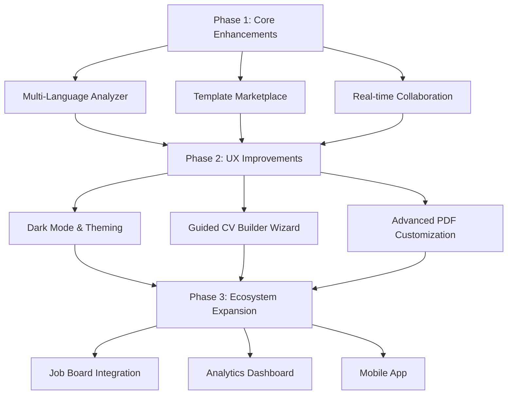

# Project Overview

The CV Builder project is a modern, AI‑enhanced resume creation platform built with Next.js, TypeScript, and Tailwind CSS. It provides:
- AI‑driven analysis and improvement of CV content.
- PDF generation with multiple template styles.
- Real‑time editing interface with autosave.
- Extensible template system and multi‑language support.

# Why the Project Is Remarkable

- **AI‑Powered CV Analyzer**: Uses industry‑specific keywords, power‑word detection, and quantitative metrics to score and improve CV sections.
- **Dynamic PDF Generation**: Generates high‑quality PDFs from HTML or data models with modern, classic, and minimal templates.
- **Modular Architecture**: Clear separation of concerns (analysis, PDF, templates, API) makes the codebase easy to extend.
- **Open‑Source Ready**: Includes mock implementations for testing and a robust CI pipeline.
- **Scalable Design**: Built on Next.js API routes, ready for serverless deployment.

# Upcoming Feature Roadmap

## Phase 1 – Core Enhancements (0‑3 months)

| Feature | Description | Timeline | Priority | Dependencies | Challenges |
|---|---|---|---|---|---|
| Multi‑Language CV Analyzer | Extend `CVAnalyzer` to support Spanish, French, German. | 1 month | High | Language datasets, i18n lib | Maintaining keyword quality across languages |
| Template Marketplace | UI for users to browse, preview, and select templates. | 2 months | Medium | Existing template system, storage for assets | Asset management, licensing |
| Real‑time Collaboration | Enable multiple users to edit the same CV simultaneously. | 3 months | Medium | WebSocket server, conflict resolution | Sync latency, data consistency |

## Phase 2 – UX Improvements (3‑6 months)

| Feature | Description | Timeline | Priority | Dependencies | Challenges |
|---|---|---|---|---|---|
| Dark Mode & Theming | Add theme switcher with persisted user preference. | 1 month | High | `theme-provider` component | Ensuring contrast in PDF export |
| Guided CV Builder Wizard | Step‑by‑step wizard with AI suggestions at each step. | 2 months | High | Phase 1 AI analyzer | Balancing guidance vs. flexibility |
| Advanced PDF Customization | Allow users to tweak colors, fonts, and layout per template. | 2 months | Medium | PDFGenerator, template CSS | Maintaining template integrity |

## Phase 3 – Ecosystem Expansion (6‑12 months)

| Feature | Description | Timeline | Priority | Dependencies | Challenges |
|---|---|---|---|---|---|
| Job Board Integration | Pull job descriptions and auto‑tailor CV content. | 4 months | Medium | External APIs, AI summarizer | API rate limits, data privacy |
| Analytics Dashboard | Track CV views, downloads, and AI improvement metrics. | 3 months | Low | Backend data store, chart library | GDPR compliance |
| Mobile App (React Native) | Offer CV editing on iOS/Android. | 5 months | Low | Shared business logic, API | Native PDF rendering differences |

# Prioritization Criteria

1. **User Impact** – Features that directly improve CV quality or user experience.
2. **Technical Feasibility** – Low‑risk items that can be delivered quickly.
3. **Strategic Value** – Features that open new revenue streams (e.g., marketplace).

# Dependencies Overview

- **AI Model** – Hosted inference service for analysis and suggestions.
- **PDF Library** – `jspdf` and `html2canvas` for rendering.
- **Database** – Prisma schema for storing user CVs, templates, and analytics.
- **External APIs** – Job board APIs, translation services.

# Potential Challenges & Mitigations

| Challenge | Mitigation |
|---|---|
| AI latency | Cache analysis results, use async background jobs |
| PDF rendering inconsistencies | Unit tests with snapshot PDFs, fallback to server‑side rendering |
| Multi‑language keyword quality | Community contributions, periodic review of keyword lists |
| Data privacy | Encrypt stored CV data, comply with GDPR/CCPA |
| Scaling WebSocket connections | Use managed services (e.g., Supabase Realtime) |

# Visual Roadmap (Mermaid)

# Next Steps

- Review this roadmap with stakeholders.
- Refine timelines based on resource availability.
- Prioritize Phase 1 features for the next sprint.